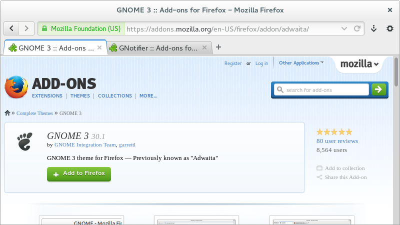
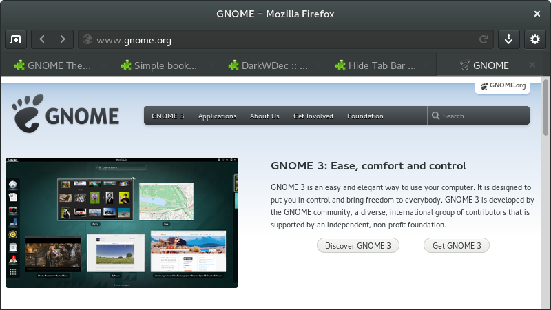
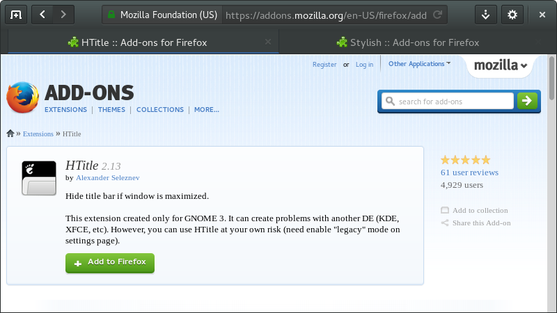

# Headerbar for Firefox

Here is complete tutorial of Firefox GNOME integration

## Basic

 * [GNOME theme](https://addons.mozilla.org/firefox/addon/adwaita/)
 * [GNotifier](https://addons.mozilla.org/firefox/addon/gnotifier/) - native desktop notifications



## Complete

 * [GNOME Theme Tweak](https://addons.mozilla.org/firefox/addon/gnome-theme-tweak/) - additional theme options
 * [Simple bookmarks menu](https://addons.mozilla.org/firefox/addon/simple-bookmarks-menu/) - hide unnecessary items in the bookmarks menu
 * [Hide Tab Bar With One Tab](https://addons.mozilla.org/firefox/addon/hide-tab-bar-with-one-tab/) - don't forget to move "new tab" button to the navigation bar
 * [DarkWDec](https://addons.mozilla.org/firefox/addon/darkwdec/) - enable dark theme variant(works with [GNOME theme 31.1b4+](https://launchpad.net/gnome-integration/firefox-gnome/firefox-gnome-releases/))
 * Change ```extensions.gnome-theme-tweak.dark-variant``` key on about:config page to "0" or "1" (for bright and dark gtk themes)



## Headerbar

 * [HTitle](https://addons.mozilla.org/firefox/addon/htitle/) - hide window titlebar
 * [Stylish](https://addons.mozilla.org/firefox/addon/stylish/) and this [userstyle](https://userstyles.org/styles/91417/)
 * Select "Download ZIP" on the right of this page, copy "Headerbar" and "Headerbar-new" theme folders from downloaded archive into <code>~/.local/share/themes/</code> - if folder does not exist - create it
 * Switch window theme to "Headerbar"(GNOME 3.x-alike) or "Headerbar-new"(GNOME 3.1x-alike) using GNOME Tweak Tool


