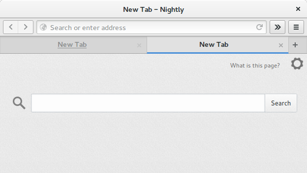
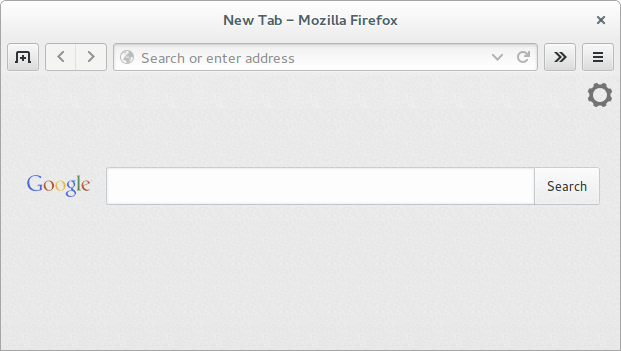
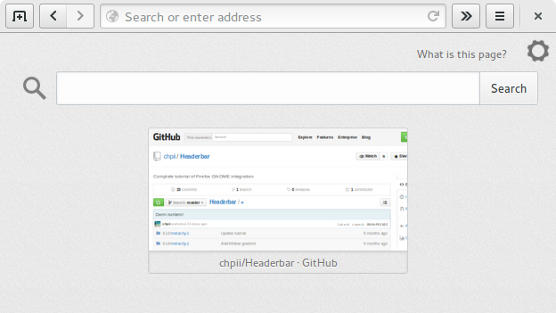
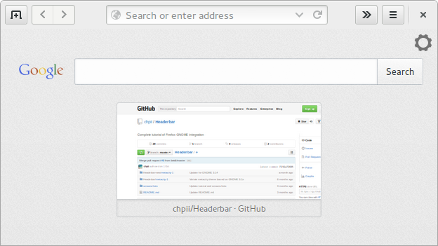
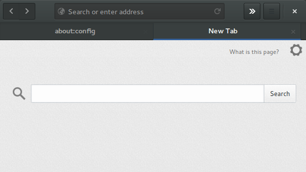

# Firefox GNOME Tutorial

This tutorial will help you to better integrate Firefox with GNOME

## Step 1

[Install extension that enables system notifications](https://addons.mozilla.org/firefox/addon/gnotifier/) instead of pop-up windows

[Install latest Firefox GNOME theme](https://github.com/gnome-integration-team/firefox-gnome/releases)

 * Restart Firefox
 * Open Firefox menu and select `Customize...`
 * go to `GNOME Tweaks` in bottom left
 * check `Relief buttons on navigation toolbar`
 * check `Bold tab label`
 * set `Maximum tab width` to `Stretch`
 * check `Hide the history dropmarker in the URL bar`

## Step 2

[Install extension that hides tabs](https://addons.mozilla.org/firefox/addon/hide-tab-bar-with-one-tab/) if there is only one tab, so saves vertical space of your screen

 * Open Firefox menu and select `Customize...`
 * Move New Tab button to the toolbar
 * Go to `about:config` and change `browser.tabs.animate` to `false` to make closing the last tab instant.
 
 This avoids arrows appearing while closing last tab:

 

## Step 3

[Install extension that hides titlebar](https://addons.mozilla.org/firefox/addon/htitle/) and puts window controls in toolbar

 * Open Firefox menu and select `Add-ons`, find HTitle preferences
 * Select `Hide titlebar: Always`

## Step 4

[Install extension to apply custom styles](https://addons.mozilla.org/firefox/addon/stylish/)

GNOME 3.16+ does not use Metacity, so you can now go to [Step 5](https://github.com/chpii/Headerbar#step-5)

If you want decoration theme that works with GNOME 3.12 or less, just replace `3.14` in commands below with `3.12` or use alternate methods

 * Restart Firefox
 * Download window decoration theme and place it in standard directory for themes using command line:

 $ `wget -P ~/.local/share/themes/3.14/metacity-1 https://raw.githubusercontent.com/chpii/Headerbar/master/3.14/metacity-1/metacity-theme-3.xml`

  * alternatively [download ZIP](https://github.com/chpii/Headerbar/archive/master.zip) and copy needed theme folder in `~/.local/share/themes`

 * Switch to installed window decoration theme using command line:

 $ `gsettings set org.gnome.desktop.wm.preferences theme "3.14"`

  * alternatively use GNOME Tweak Tool

## Step 5

Install userstyle that improves paddings and make it look like other GNOME applications

 * [Headerbar style for GNOME 3.14-](https://userstyles.org/styles/91417)
 * [Headerbar style for GNOME 3.16+](https://userstyles.org/styles/96733)
 * [GNOME styled menu List view](https://userstyles.org/styles/115022)

## Dark theme

 * [Install dark window decoration extension](https://addons.mozilla.org/firefox/addon/darkwdec/)
 * Enter `about:config` in adress field to access advanced preferences 
 * Change `extensions.gnome-theme-tweak.dark-variant` key to `1` to switch dark theme on

## Other useful extensions

 * [GNOME Keyring integration](https://addons.mozilla.org/firefox/addon/gnome-keyring-integration-1/)
 * [Hide Sync in Menu](https://addons.mozilla.org/firefox/addon/hide-sync-in-menu/)
 * [Simple bookmarks menu](https://addons.mozilla.org/firefox/addon/simple-bookmarks-menu/)
